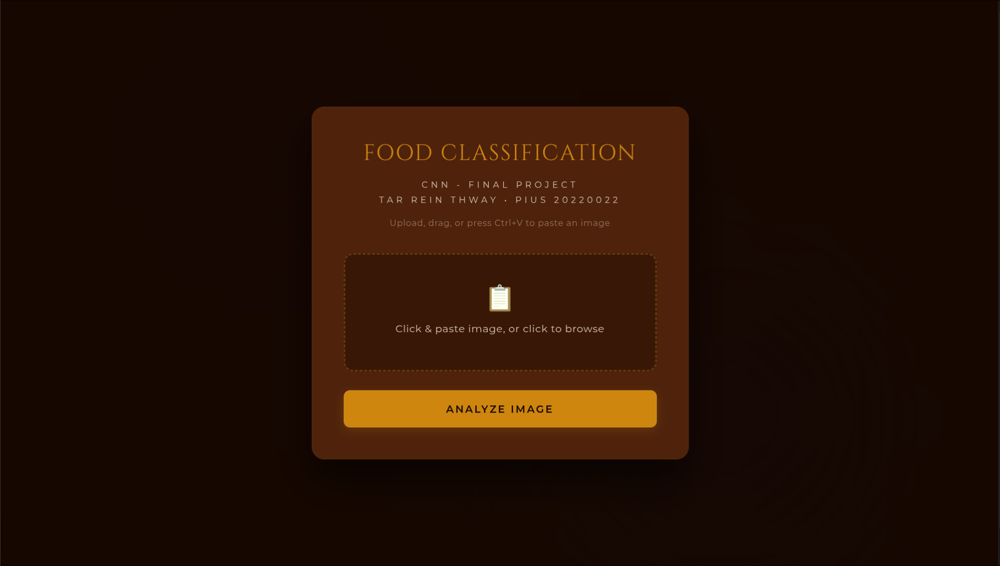
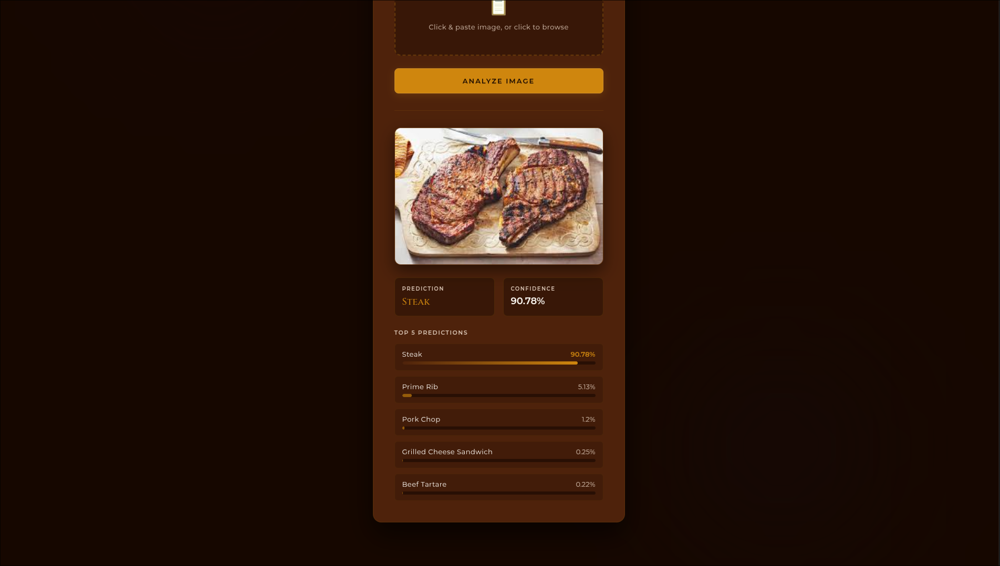

#  🍳 FOOD Classification 

> **About this project**
> This project was developed as the final assignment for the Advanced Machine Learning course taught by Professor Nwe Nwe Htay Win. The goal of the project is to classify images across 101 different food categories using deep learning and transfer learning techinques.

This repository covers the complete machine learning workflow -- from dataset preparation and model training to deployment through an interactive [web application](https://foodddd-ftfqhgejajahhcen.japaneast-01.azurewebsites.net) hosted on Microsoft Azure.

---

## 📱 The Live Web Application

### 1. Upload Interface

### 2. Real-Time Model Prediction

> **How to use the web app**
> Upload an image from your device and click **Analyze Image** to receive predictions from the model!
> You can also copy an image directly from the internet and paste it into the upload area, and analyze it instantly!
